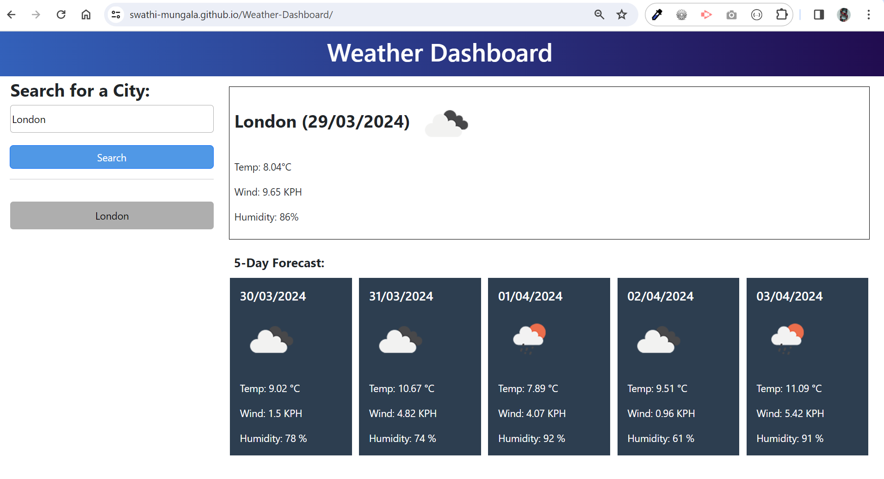

# Weather-Dashboard
Welcome to Weather Dashboard. Here you can see weather forecast featuring form inputs, allowing users to search for cities and view current/future conditions including city name, date, weather icon, temperature, humidity, wind speed, and a 5-day forecast; also enabling users to revisit searched cities' weather details with a click on the search history.

## website screenshot
- Here is the screenshot of Weather-Dashboard website.

## Live site link
Here is the link of Weather-Dashboard website
[Live site link](https://swathi-mungala.github.io/Weather-Dashboard/)

## Github repo link
Here is the link of Weather-Dashboard Github repo
[Github repo](https://github.com/swathi-mungala/Weather-Dashboard)

## Installation
Clone the repository from github to your local using HTTPS or SSH or Github CLI and then run it in local.
![Installation]

## Usage
N/A

## Credits

N/A

## License

[MIT](https://choosealicense.com/licenses/mit/)

## Badges

N/A

## Features

N/A

## How to Contribute

N/A

## Tests

N/A